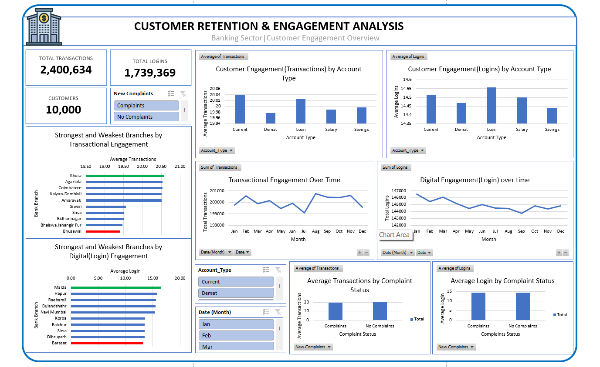
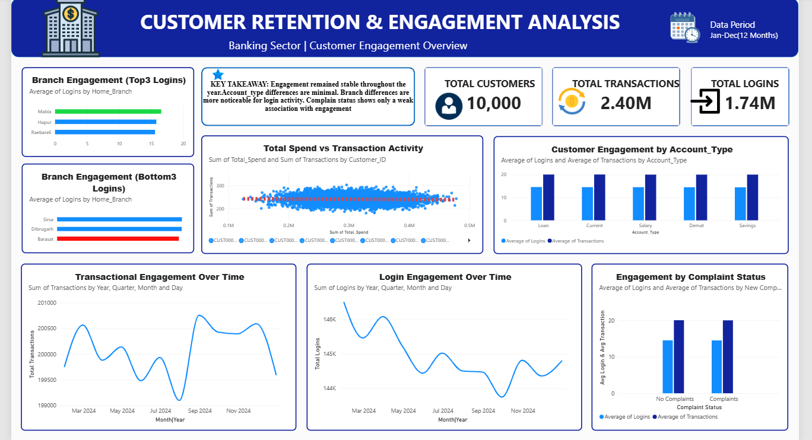

# Customer Retention and Engagement Analysis in the Banking Sector

## Project Overview

Customer retention is an important business concern in the banking sector, as understanding how customers interact with banking services can help organizations identify engagement patterns and potential areas for improvement.

This project analyzes customer activity data to examine customer engagement patterns and identify behavioural factors and customer segments that may have implications for customer retention.

Customer engagement is measured using two proxy indicators available in the dataset:

* **Number of Transactions**
* **Number of Customer Logins**

The project combines **Excel** for data analysis and **Power BI** for interactive dashboard development.

---

## Business Problem

Banks need to understand how customers interact with their services in order to identify engagement patterns and areas that may have implications for customer retention.

The key business problem addressed in this project is:

> **How can a bank understand and improve customer retention and engagement using customer activity data?**

---

## Project Objective

The objective of this project is to:

> **Analyze customer engagement patterns and identify behavioural factors and customer segments that may have implications for customer retention.**

---

## Business Questions

The analysis was designed to answer five key business questions:

1. **How does customer engagement change over time?**
2. **Which account types have the highest engagement?**
3. **What factors are associated with higher engagement?**
4. **Which branches have the strongest and weakest engagement?**
5. **How do customer complaints relate to engagement?**

---

## Dataset

The project uses a **Customer Retention Time Series Dataset** containing customer-level banking activity data.

The dataset contains **120,000 records representing 10,000 unique customers**.

Customer activity is observed across the available time period, allowing engagement patterns to be examined over time and across different customer characteristics.

### Key Data Fields

The dataset contains information relating to areas such as:

* Customer identification
* Account type
* Branch
* Transactions
* Customer logins
* Total spending
* Customer complaints
* Time/date-related information

Certain fields that were not necessary for the analysis, including sensitive-looking account/contact information, were excluded from the analytical process.

---

# Methodology

The project followed a structured data analysis workflow.

### 1. Data Understanding

The dataset was first reviewed to understand:

* The number of records
* The number of unique customers
* Available variables
* Data types
* Customer activity measures
* Variables relevant to the business questions

A count of the dataset showed **120,000 records and 10,000 unique customer IDs**.

---

### 2. Data Preparation

The data was prepared for analysis by identifying the fields relevant to the project objectives and excluding unnecessary fields.

The analysis focused on customer activity variables that could provide meaningful measures of engagement.

Because the dataset did not contain a direct customer engagement score, engagement was measured using two proxy indicators:

* **Transactions**
* **Logins**

---

### 3. Exploratory Analysis

Pivot tables were created in Excel to examine customer activity from different perspectives.

The analysis included:

* Monthly transaction activity
* Monthly login activity
* Engagement by account type
* Relationships between engagement-related variables
* Branch-level engagement
* Customer complaint and engagement patterns

---

### 4. Engagement Analysis

Two primary engagement indicators were used:

**Transaction Activity**

The total number of transactions recorded across the analyzed period was:

**2,400,643 transactions**

Monthly transaction activity remained relatively stable, with monthly values ranging approximately from **199,000 to 201,000 transactions**.

**Login Activity**

The total number of customer logins recorded was:

**1,739,369 logins**

Monthly login activity also remained relatively stable, ranging approximately from **143,745 to 146,487 logins**.

---

### 5. Account Type Analysis

Average transaction and login activity were compared across account types to identify differences in engagement.

For example:

| Account Type    | Average Transactions | Average Logins |
| --------------- | -------------------: | -------------: |
| Current         |              20.0382 |        14.5132 |
| Overall Average |              20.0054 |        14.4947 |

This analysis was used to compare engagement levels across customer account segments.

---

### 6. Relationship Analysis

Correlation analysis was performed to examine whether the engagement and spending variables had meaningful linear relationships.

The observed correlations included:

| Variables                  |  Correlation |
| -------------------------- | -----------: |
| Total Spend & Transactions | -0.001564464 |
| Transactions & Logins      |  0.000483509 |
| Logins & Total Spend       |  0.000879868 |

These correlation values are all very close to zero, indicating that the variables showed **little to no linear relationship** in this dataset.

---

## Key Findings and Insights

### 1. Customer engagement remained relatively stable over time

Both transaction activity and login activity remained relatively stable throughout the analyzed period.

There were fluctuations from month to month, but no major sustained increase or decrease in overall engagement was observed.

---

### 2. Transaction and login activity showed similar overall stability

The two engagement indicators followed relatively stable patterns over time.

Although individual monthly values fluctuated, overall activity did not show a major upward or downward trend.

---

### 3. Engagement differed only slightly across account types

The account-type analysis showed that average engagement levels were relatively close to the overall averages.

For example, Current accounts recorded:

* **20.0382 average transactions**
* **14.5132 average logins**

compared with overall averages of:

* **20.0054 average transactions**
* **14.4947 average logins**

This suggests that the differences in average engagement between account segments were relatively small.

---

### 4. Engagement variables showed very weak linear relationships

The correlation analysis produced values very close to zero for:

* Transactions and Logins
* Transactions and Total Spend
* Logins and Total Spend

This indicates that higher activity in one of these measures did not necessarily correspond to higher activity in another measure in a linear sense.

---

## Tools Used

### Microsoft Excel

Excel was used for:

* Data exploration
* Data preparation
* Pivot table analysis
* Descriptive analysis
* Correlation analysis
* Dashboard development

### Power BI

Power BI was used for:

* Data visualization
* Interactive dashboard development
* Presenting key performance indicators
* Presenting engagement patterns
* Creating a visual summary of the analysis

---

## Dashboard

Two dashboards were developed as part of the project:

### Excel Dashboard

The Excel dashboard provides a visual summary of the customer engagement analysis.



### Power BI Dashboard

The Power BI dashboard presents the analysis in an interactive business intelligence format.



---

## Project Deliverables

This repository contains:

* **Customer_Retention_Analysis.xlsx** — Excel workbook containing the analysis and dashboard.
* **Customer_Retention_Dashboard.pbix** — Power BI dashboard file.
* **Excel_Dashboard.png** — Screenshot of the Excel dashboard.
* **PowerBI_Dashboard.png** — Screenshot of the Power BI dashboard.

---

## Project Structure

```text
Customer-Retention-and-Engagement-Analysis/
│
├── README.md
├── Customer_Retention_Analysis.xlsx
├── Customer_Retention_Dashboard.pbix
├── Excel_Dashboard.png
└── PowerBI_Dashboard.png
```

---

## Limitations

This analysis has some important limitations.

### No Direct Customer Retention/Churn Variable

The dataset did not provide a direct retention or churn outcome that could be used to determine whether a specific customer was retained or lost.

Therefore, the project focuses on **customer engagement patterns and behavioural indicators that may have implications for retention**, rather than directly predicting customer churn.

### Engagement Was Measured Using Proxy Indicators

Because there was no direct engagement score, engagement was measured using:

* Transaction activity
* Login activity

These measures provide useful indicators of customer activity but do not capture every aspect of customer engagement.

### Correlation Does Not Establish Causation

The correlation analysis identifies the strength of linear relationships between variables. It does not establish that one variable causes another.

---

## Conclusion

This project demonstrates how customer activity data can be analyzed to understand engagement patterns in the banking sector.

The analysis found that overall transaction and login activity remained relatively stable throughout the analyzed period. Account-type engagement levels were also relatively close to the overall averages, while correlation analysis showed very weak linear relationships between transactions, logins, and total spending.

The findings demonstrate the importance of using multiple customer activity indicators when evaluating engagement. While the dataset does not directly measure customer retention or churn, the analysis provides a foundation for understanding customer behaviour and identifying areas that could be explored further when more direct retention data is available.

---

## Skills Demonstrated

* Data Analysis
* Data Cleaning & Preparation
* Microsoft Excel
* Pivot Tables
* Descriptive Analysis
* Correlation Analysis
* Data Visualization
* Dashboard Development
* Power BI
* Business Question Development
* Business Intelligence
* Data Storytelling
* Insight Generation
